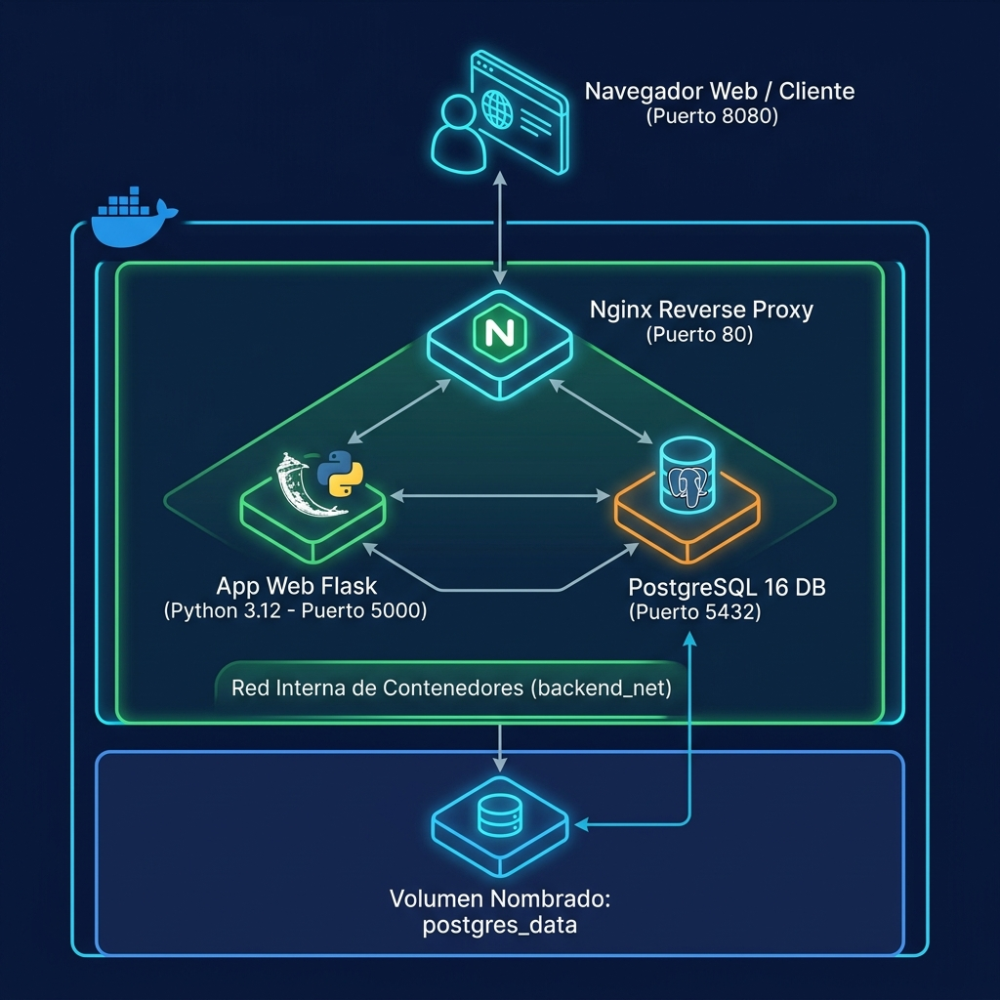

# 🐳 Docker desde Cero: Crea y Despliega Aplicaciones en Producción (10ma Edición 2026)

[](https://www.docker.com/)
[](https://docs.docker.com/compose/)
[](https://nginx.org/)
[](https://www.postgresql.org/)
[](https://nextcloud.com/)
[](https://www.onlyoffice.com/)
[](https://mariadb.org/)
[](https://redis.io/)
[](./LICENSE)

Bienvenido al repositorio oficial del curso **Docker desde Cero: Crea y Despliega Aplicaciones**, diseñado e impartido para la comunidad universitaria de la **Universidad Nacional de Ingeniería (UNI)** — Oficina de Tecnologías de la Información (OTI).

---

## 🎯 Objetivo del Curso
Formar a los estudiantes e ingenieros en el diseño, empaquetamiento, orquestación y despliegue de microservicios y plataformas empresariales en producción utilizando **Docker, Docker Compose, Nginx, PostgreSQL, Redis, MariaDB, Nextcloud y OnlyOffice**.

---

## 🗺️ Ruta de Aprendizaje del Curso por Sesión (1 a 6)

| Sesión | Tema Principal | 📖 Clase Teórica | 🧪 Trabajo / Lab a Realizar | 💻 Código Fuente |
|:---:|---|:---:|:---:|:---:|
| **Sesión 01** | 🐳 **Contenedores desde Cero** | [Ver Clase](./clases/01-contenedores-desde-cero.md) | [Realizar Lab 01](./laboratorios/sesion1/README.md) | [Código S1](./codigo/sesion1/) |
| **Sesión 02** | 📦 **Dockerfile Profesional** | [Ver Clase](./clases/02-dockerfile-profesional.md) | [Realizar Lab 02](./laboratorios/sesion2/README.md) | [Código S2](./codigo/sesion2/) |
| **Sesión 03** | 🧩 **Docker Compose Multi-Contenedor** | [Ver Clase](./clases/03-docker-compose.md) | [Realizar Lab 03](./laboratorios/sesion3/README.md) | [Código S3](./codigo/sesion3/) |
| **Sesión 04** | 🌐 **Redes, Volúmenes y Persistencia** | [Ver Clase](./clases/04-redes-volumenes-persistencia.md) | [Realizar Lab 04](./laboratorios/sesion4/README.md) | [Código S4](./codigo/sesion4/) |
| **Sesión 05** | 🛡️ **Docker en Producción (Proxy & Multi-Stage)** | [Ver Clase](./clases/05-docker-en-produccion.md) | [Realizar Lab 05](./laboratorios/sesion5/README.md) | [Código S5](./codigo/sesion5/) |
| **Sesión 06** | 🚀 **Proyecto Final 1: Stack Web Multi-Contenedor** | [Ver Clase](./clases/06-proyecto-final.md) | [Realizar Lab 06](./laboratorios/sesion6/README.md) | [Código S6](./codigo/sesion6/) |
| **Proyecto Capstone** | ☁️ **Proyecto Final 2: Nube Privada (UNI Drive + OnlyOffice)** | [Ver Guía Drive](./laboratorios/sesion6/proyecto_drive/README.md) | [Realizar Proyecto Drive](./laboratorios/sesion6/proyecto_drive/README.md) | [Código Drive](./codigo/sesion6/proyecto_drive/) |

---

## 🏛️ ARQUITECTURAS DE LOS PROYECTOS FINALES EN PRODUCCIÓN

Los estudiantes construyen y despliegan paso a paso las siguientes dos infraestructuras de nivel empresarial:

### 🔹 1. Proyecto Final 1: Stack Web Multi-Contenedor (Flask + PostgreSQL + Nginx)

<p align="center">
  
</p>

* **📂 Ver Código Fuente:** [`./codigo/sesion6/`](./codigo/sesion6/)
* **🧪 Ver Guía de Laboratorio:** [`./laboratorios/sesion6/`](./laboratorios/sesion6/)

---

### 🔹 2. Proyecto Final Capstone: Nube Privada Institucional (UNI Drive con Nextcloud + OnlyOffice + MariaDB + Redis)

<p align="center">
  
</p>

* **📂 Ver Archivos de Despliegue del Proyecto 2 (Drive):** [`./codigo/sesion6/proyecto_drive/`](./codigo/sesion6/proyecto_drive/)
* **🧪 Ver Guía Completa de Laboratorio del Proyecto 2:** [`./laboratorios/sesion6/proyecto_drive/`](./laboratorios/sesion6/proyecto_drive/)
* **📄 Docker Compose listo para ejecutar:** [`./codigo/sesion6/proyecto_drive/docker-compose.yml`](./codigo/sesion6/proyecto_drive/docker-compose.yml)

---

## 🚀 Inicio Rápido de la Nube Privada (Proyecto 2 - Drive)

Para clonar el repositorio y ejecutar el **Proyecto Final 2 (Nube Privada UNI Drive)** en tu máquina local:

```bash
# 1. Clonar el repositorio
git clone https://github.com/Crsitian22/docker-desde-cero-pit.git
cd docker-desde-cero-pit

# 2. Entrar a la carpeta del Proyecto 2 (UNI Drive)
cd codigo/sesion6/proyecto_drive

# 3. Levantar los 4 contenedores en segundo plano (Nextcloud, OnlyOffice, MariaDB 11.4, Redis)
docker compose up -d

# 4. Probar en el navegador
# Nextcloud Drive: http://localhost:8080
# OnlyOffice Document Server: http://localhost:8081
```

---

## 📂 Estructura General del Repositorio

```text
docker-desde-cero-pit/
├── 📁 clases/                 # Guías y lecturas teóricas de cada sesión (01 a 06)
├── 📁 codigo/                 # Código fuente ordenado por sesión (Sesiones 1 a 6)
│   ├── sesion1/               # App Flask inicial en contenedor
│   ├── sesion2/               # Dockerfile profesional con .dockerignore
│   ├── sesion3/               # Stack Flask + PostgreSQL con Docker Compose
│   ├── sesion4/               # Redes privadas, volúmenes y backups SQL
│   ├── sesion5/               # Nginx Reverse Proxy y Multi-Stage Build
│   └── sesion6/               # Proyecto final 1 y proyecto_drive (Proyecto 2)
│       └── proyecto_drive/    # 🚀 PROYECTO 2: Nube Privada (docker-compose.yml de Nextcloud + MariaDB + Redis + OnlyOffice)
├── 📁 imagenes/               # Diagramas 3D nítidos de arquitectura en español
├── 📁 laboratorios/           # Guías de trabajos y ejercicios a realizar por el alumno (Sesiones 1 a 6)
│   └── sesion6/
│       └── proyecto_drive/    # 🧪 Guías del Proyecto 2
├── 📁 recursos/               # Recursos del estudiante y Cheat Sheet oficial en PDF
└── 📄 README.md               # Portada oficial del curso
```

---


---

## 🔗 Enlaces Oficiales de Descarga e Instalación

Para preparar el entorno de trabajo durante las clases y laboratorios del curso, utiliza los siguientes enlaces a la documentación y descargas oficiales:

### 🐳 1. Docker & Docker Compose
* 🪟 **Docker Desktop para Windows (WSL2 Backend):** [Descargar Docker Desktop para Windows Oficial](https://www.docker.com/products/docker-desktop/)
* 🍎 **Docker Desktop para macOS (Apple Silicon / Intel):** [Descargar Docker Desktop para Mac Oficial](https://docs.docker.com/desktop/install/mac-install/)
* 🐧 **Docker Engine en Linux (Ubuntu Server / Debian):** [Guía Oficial de Instalación de Docker Engine en Ubuntu](https://docs.docker.com/engine/install/ubuntu/)
* 🧩 **Docker Compose (Plugin v2):** [Guía Oficial de Instalación de Docker Compose](https://docs.docker.com/compose/install/)

### 🐧 2. Sistemas Operativos, WSL2 e Hipervisores
* 💻 **WSL2 (Windows Subsystem for Linux v2):** [Guía Oficial de Instalación de WSL2 (Microsoft Docs)](https://learn.microsoft.com/es-es/windows/wsl/install)
* 📦 **Oracle VM VirtualBox:** [Descargar Oracle VM VirtualBox Oficial](https://www.virtualbox.org/wiki/Downloads)
* 💿 **ISO de Ubuntu Server LTS:** [Descargar ISO Oficial de Ubuntu Server 24.04 LTS](https://ubuntu.com/download/server)


## 💻 Requisitos del Sistema

- **Docker:** Docker Desktop (Windows/macOS) o Docker Engine (Linux).
- **Docker Compose:** Versión 2.x o superior (`docker compose`).
- **Terminal:** Bash / PowerShell / Zsh.
- **Hardware Recomendado:** 4 GB de RAM (8 GB recomendado).

---

## 👨‍🏫 Información del Docente y Créditos

- **Docente:** Cristian Jampier Chileno Segundo (Astra)
- **Institución:** Oficina de Tecnologías de la Información (OTI) — Universidad Nacional de Ingeniería (UNI)
- **Programa:** Programa de Iniciación Tecnológica (PIT 2026) — 10ma Edición
- **Licencia:** Material educativo de acceso libre para la comunidad de la UNI.
