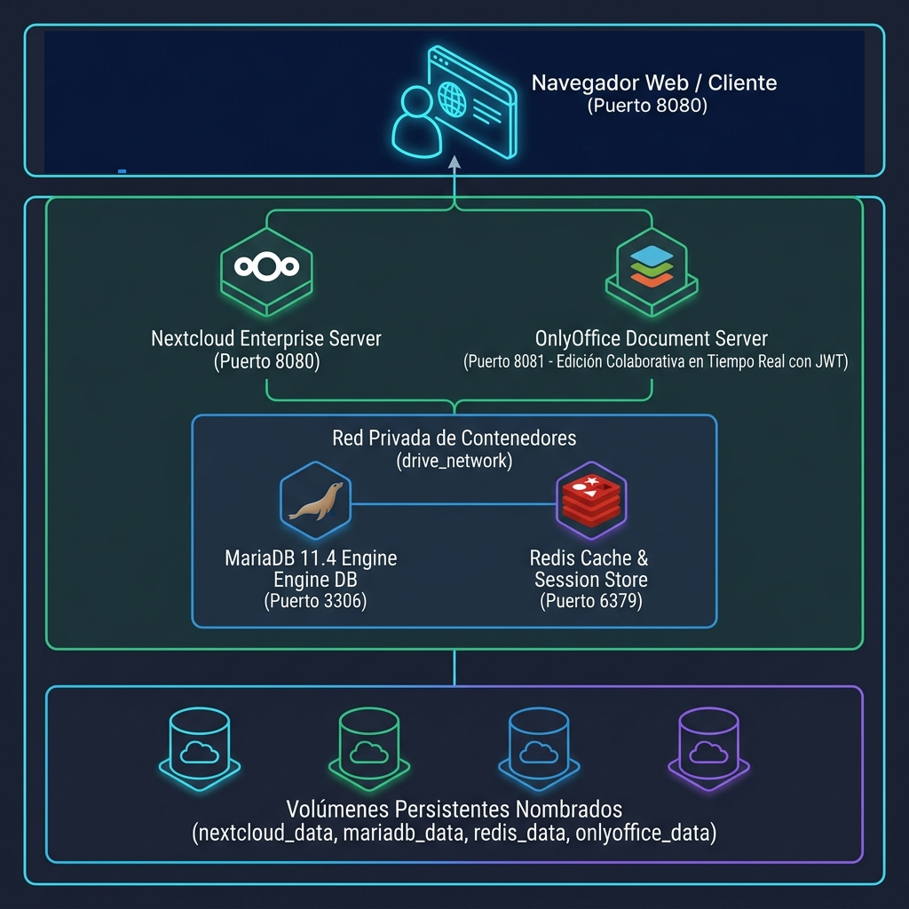
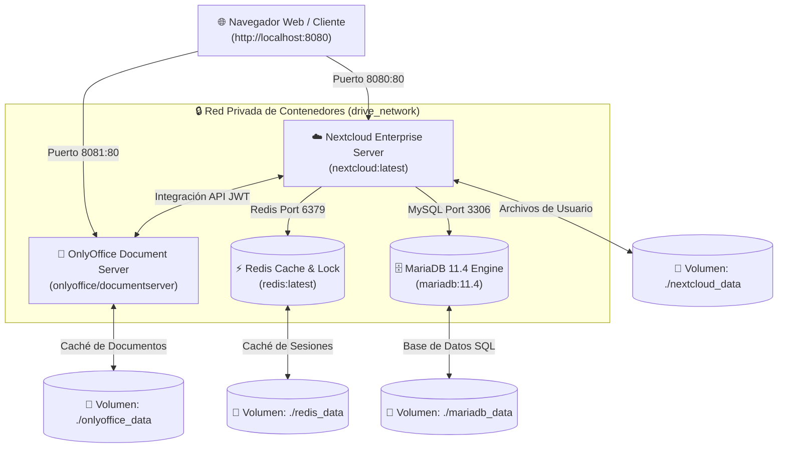

# 🚀 Proyecto Final Capstone: Nube Privada Institucional (UNI Drive + OnlyOffice)

¡Bienvenido al **Proyecto Integrador Capstone** del curso **Docker desde Cero**! En este proyecto avanzado de producción, desplegarás tu propia suite empresarial de almacenamiento en la nube e integración de edición de documentos en tiempo real (remplazo de Google Drive / Microsoft 365) utilizando **Nextcloud Enterprise**, **OnlyOffice Document Server**, **MariaDB 11.4** y **Redis**.

---

## 🏛️ Arquitectura de la Nube Privada (Drive + OnlyOffice)

<p align="center">
  
</p>



---

## 📋 Buenas Prácticas Aplicadas en este Proyecto
1. **Edición Colaborativa en Tiempo Real:** Integración directa con `OnlyOffice Document Server` protegido con tokens de autenticación JWT (`JWT_ENABLED=true`).
2. **Base de Datos de Alto Rendimiento:** MariaDB 11.4 optimizado con aislamiento de transacciones `READ-COMMITTED`.
3. **Caché y Bloqueo de Archivos con Redis:** Sincronización ultrarrápida sin bloqueos de lectura/escritura en discos.
4. **Habilitación de Módulos Apache & Certbot SSL:** Configuración de Reverse Proxy con Apache (`proxy_http`, `headers`) y certificados HTTPS automáticos con `certbot`.

---

## ⚡ Guía Paso a Paso de Despliegue

```bash
# 1. Navegar a la carpeta del proyecto
cd codigo/sesion6/proyecto_drive

# 2. Levantar los 4 contenedores en segundo plano
docker compose up -d

# 3. Verificar que los 4 contenedores estén en estado Running
docker compose ps

# 4. Acceso a las aplicaciones web:
# Nextcloud Drive: http://localhost:8080
# OnlyOffice Server: http://localhost:8081
```

---

## 🌐 Configuración del Proxy Reverso Apache con SSL (Certbot en Producción)

Para el despliegue 100% local en tu equipo:

```bash
# 1. Habilitar módulos de Proxy en Apache Host
sudo a2enmod headers
sudo a2enmod proxy
sudo a2enmod proxy_http

# 2. Habilitar el sitio virtual
sudo a2ensite localhost.conf

# 3. Generar Certificado SSL Gratuito con Certbot
# Acceso local: http://localhost:8080
```

---

## 🎓 Configuración de OnlyOffice dentro de Nextcloud
1. Inicia sesión como administrador en Nextcloud (`http://localhost:8080`).
2. Ve a **Apps ➔ Aplicaciones Oficiales** y activa la extensión **ONLYOFFICE**.
3. En **Ajustes de Administración ➔ ONLYOFFICE**:
   - **Dirección del Document Editing Service:** `http://onlyoffice:80/` (o `http://localhost:8081`)
   - **Clave Secreta (JWT Secret):** `local_jwt_secret_key_2026`
4. ¡Listo! Ahora todos los alumnos pueden crear y editar archivos de Word, Excel y PowerPoint colaborativamente desde la nube.
